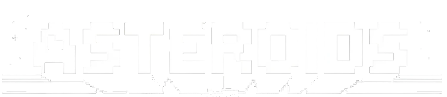
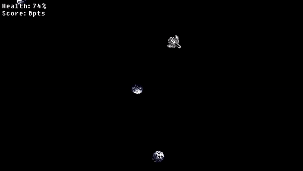

Asteroids recreation as my final project for the C++ course.

Asteroids is a classic game
that first appeared on an Atari arcade cabinet in the late 70s.
It's a game where players fly around in an asteroid field with
the goal to score destroy asteroids, score points, and survive.

## Features

- Smooth spaceship controls for rotation and thrust
- Dynamic camera that adjusts to window resizing
- Ability to shoot bullets to destroy asteroids
- Collision detection
- Elastic collision physics
- Health tracking
- Score tracking  


  

## Getting Started
### Prerequisites

- C++17 compatible compiler
- Vcpkg
- [threepp](https://github.com/markaren/threepp) - A C++ 3D graphics library for OpenGL

### Installation

1. Clone the repository:
   ```sh
   git clone https://github.com/Joranikus/Asteroids.git

2. Compile game

3. Run game

### Game Controls

- "A" - Rotate the spaceship to the left.
- "D" - Rotate the spaceship to the right.
- "W" - Apply thrust to move forward.
- "S" - Apply thrust to move backward.
- "SPACE" - Fire a bullet.

## Project Structure

### Controllers
All the controllers are based on the virtual class "BaseController".
- **"BaseController"** - A virtual class base class for moving object, contains physics and common attributes.
- **"AsteroidController"** - Contains specific behaviour for asteroids.
- **"BulletController"** - Contains specific behaviour for bullets.
- **"SpaceshipController"** - Contains specific behaviour for the spaceship.

### Factories
All the factories are based on the virtual class "BaseFactory".
- **"BaseFactory"** - A virtual class made for producing multiples of objects using the different controllers.
- **"AsteroidFactory"** - Contains specific attributes and methods to produce asteroids.
- **"BulletFactory"** - Contains specific attributes to produce bullets.

### Collision Detectors
Most of the collision detectors are based on the virtual class "BaseCollisionDetector".
- **"BaseCollisionDetector"** - A virtual class made to use as a simple basis for the collision detectors.
- **"ElasticCollisionDetector"** - A collision class using elastic collision physics when objects collide.
- **"AsteroidBulletCollisionDetector"** - A collision class used to detect when bullets hit asteroids, and methods accordingly.
- **"AsteroidSpaceshipCollisionDetector""** - A collision class based on the ElasticCollisionDetector specifically when asteroids and the spaceship collide.

### Game Systems
Classes used for the game
- **"HUD"** - HUD or Heads up display class used to display various elements on the screen.
- **"Game"** - The Game class sets up all the various settings and variables, it condenses everything to a few concise functions.

### Functions
Function headers
- **"Random Functions"** - The random function header is filled with functions that generate random things.
- **"Create Sprite"** - The create sprite header is filled with one function that simplifies creating sprites.

## Sources
All the images used are created using ChatGPT DALL-E image generator.

## Exam Candidate Number
### 00000000000